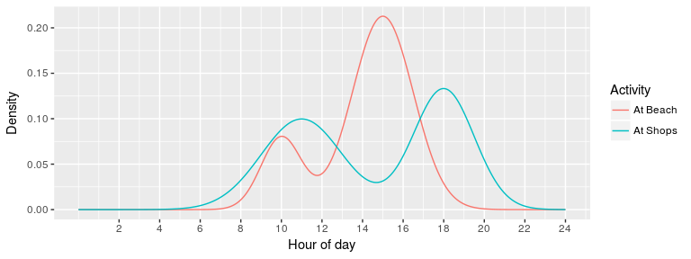

[Surf Coast Shire](https://www.openstreetmap.org/relation/3290432) is unique in its population makeup on a given summer day, due to the significant high number of tourists in and around the townships that line the [Great Ocean Road](https://www.openstreetmap.org/relation/6592912). For instance, accounts from emergency services personnel suggest that the population of Angleasea can be as high as `15000` persons on a summer day, when the [resident population of Anglesea according to the 2016 census is around `2600`](http://www.censusdata.abs.gov.au/census_services/getproduct/census/2016/quickstat/SSC20045).  In looking to construct a synthetic population for Surf Coast Shire for the purposes of evacuation modelling then, it is importnat that the significantly high volume of traffic from tourism related activities in the area is accounted for. Further, the behaviour of tourists in case of an emergency is likely to differ from local residents, at least as far as knowledge of local roads is concerned.

One way to to approach the problem is to construct the population in *layers* of identified groups of people, that are then superimposed to create a final population on a given day. This gives finer control over modelled scenarios, such as to capture days with "packed" beaches, special events like the Falls Festival, and/or high through-traffic. 

## Evacuee types

Initial discussions with stakeholders (at Anglesea CFA, 16/04/18) identified the following three groups that conceptually make up the population:

* **Residents** : as captured by the [ABS census data](http://www.censusdata.abs.gov.au/census_services/getproduct/census/2016/quickstat/LGA26490); several methods exist for creating a synthetic population for this cohort, and one that could be readily applied here is the [algorithm from Wicramasinghe et al.](https://github.com/agentsoz/synthetic-population) from RMIT University. 
* **Regular visitors** : people that regularly visit the region during the summer months, camping or in *holiday homes*, and have a working knowledge of local roads and destinations; some information on this cohort could be derived from [VISTA data](https://transport.vic.gov.au/data-and-research/vista/). (<mark>Any other dataset that might give stats on this group?</mark>)
* **Tourists** : people that visit the region for the day or on a short-stay visit, and generally do not know the area well; some information on this cohort could be derived from [VISTA data](https://transport.vic.gov.au/data-and-research/vista/). (<mark>Any other dataset that might give stats on this group?</mark>)

These would likely be entered into DSS in the following format:

Type | Total numbers
----- | -----
Resident | 2500 (from ABS)
Regular Visitor | 2000
Tourist | 7000


## Evacuee response to messaging

The following table shows a suggested distribution of responses to various messages, for different types of persons (**each row must add up to 100%**). <mark>For discussion with Surf Coast Shire.</mark>

Person type | Evacuate on `Advice` | Evacuate on `Watch & Act` | Evacuate on `Evacuate Now` | Will not evacuate | Justification 
--------------|---------|---------|---------|---------|--------------------------------------------
Resident | 5% | 15% | 50% | 30% | Least likely to react to initial warnings; most likely to stay back 
Regular Visitor | 10% | 20% | 60% | 10% | More likely to react to warnings; less likely to stay back 
Tourist | 15% | 25% | 60% | 0% | Most likely to react early; least likely to stay back 

## Whereabouts of the population during the day

The current approach for building an understanding of the activities and whereabouts of the population at the time of the first warning is based on combining various sources of information to produce a trip-based activity plan for each person (see [example Surf Coast Shire trips](../from-scsc-201804/analysis-data-from-scsc-201804.html)). The trips can then be played out in MATSim, as a preparatory step, and *snapshots* of the population taken at desired times during the simulated day. These time-of-day based snapshots can then be used as inputs for evacuation scenarios as required.  
The key drawback of this approach is that the preparatory process requires manual manipulation (currently restricted to SCS personnel to produce the trips CSV file) which can be time consuming. This inherently restricts the amount of variation that can be built into the initial population, since each variation requires a separate application of the above process. For instance, it would be difficult to easily construct sets of initial populations that vary only in terms of size and makeup with respect to the identified evacuee groups.

The suggested approach would be to instead specify the initial population and its time-of-day based activities in terms of distributions, that are more amenable to easy manipulation between scenarios. This would remove the manual preprocessing step altogether, since the starting population for any new scenario would be fully described by and built from these distributions alone. For instace, the activity-based behaviours of the population could likely be simplified to being `at home`, `at work`, `at shops`, `at beach`, or `at other location`. These distributions would "look" similar for all types of persons, however the proportion of each type performing those activities would vary. 

Below is an example showing what two such distribution might look like:


```
## Warning: package 'ggplot2' was built under R version 3.3.2
```

<!-- -->

Proportion of the population of each type, likely to perform a given activity during the day (will be applied to the time-of-day distributions above):

Activity | Resident | Regular Visitor | Tourist
----- | ----- | ----- | -----
`At Home` | - | - | -
`At Work` | - | - | - 
`At Beach` | 0.3 | 0.7 | 0.9 
`At Shops` | 0.5 | 0.7 | 0.9 
`At Other Location` | - | - | - 

Each activity will in turn be associated with a location, a set of locations, or areas (polygons).

The above information could then be used to automatically construct a "daily plan" for a given person. It may include several of the above activities, based on values specified in the ablve table. The information above is sufficient to determine the wherabouts of the full population at any time during the day.


