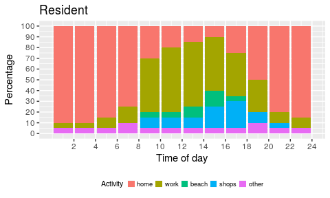
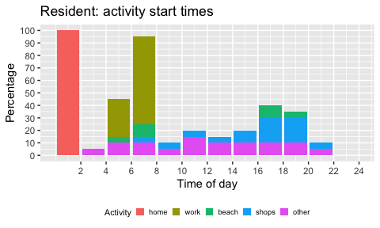
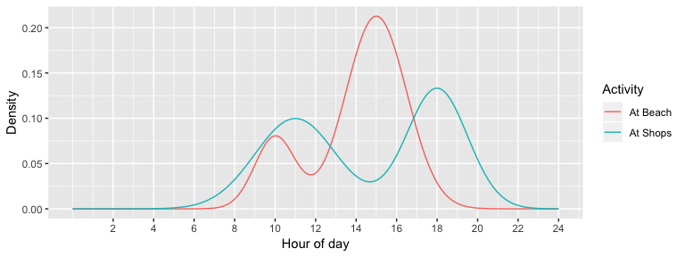
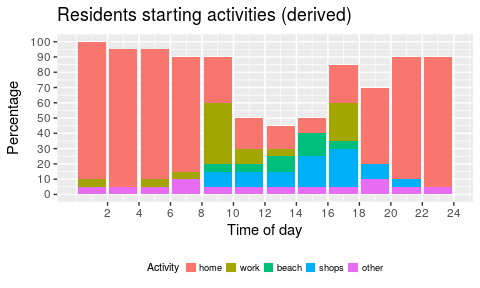

[Surf Coast Shire](https://www.openstreetmap.org/relation/3290432) is unique in its population makeup on a given summer day, due to the significant high number of tourists in and around the townships that line the [Great Ocean Road](https://www.openstreetmap.org/relation/6592912). For instance, accounts from emergency services personnel suggest that the population of Angleasea can be as high as `15000` persons on a summer day, when the [resident population of Anglesea according to the 2016 census is around `2600`](http://www.censusdata.abs.gov.au/census_services/getproduct/census/2016/quickstat/SSC20045).  In looking to construct a synthetic population for Surf Coast Shire for the purposes of evacuation modelling then, it is importnat that the significantly high volume of traffic from tourism related activities in the area is accounted for. Further, the behaviour of tourists in case of an emergency is likely to differ from local residents, at least as far as knowledge of local roads is concerned.

One way to to approach the problem is to construct the population in *layers* of identified groups of people, that are then superimposed to create a final population on a given day. This gives finer control over modelled scenarios, such as to capture days with "packed" beaches, special events like the Falls Festival, and/or high through-traffic. 

## Evacuee types

Initial discussions with stakeholders (at Anglesea CFA, 16/04/18) identified the following three groups that conceptually make up the population:

* **Residents** : as captured by the [ABS census data](http://www.censusdata.abs.gov.au/census_services/getproduct/census/2016/quickstat/LGA26490); several methods exist for creating a synthetic population for this cohort, and one that could be readily applied here is the [algorithm from Wicramasinghe et al.](https://github.com/agentsoz/synthetic-population) from RMIT University. 
* **Regular visitors** : people that regularly visit the region during the summer months, camping or in *holiday homes*, and have a working knowledge of local roads and destinations; some information on this cohort could be derived from [VISTA data](https://transport.vic.gov.au/data-and-research/vista/). (<mark>Any other dataset that might give stats on this group?</mark>)
* **Tourists** : people that visit the region for the day or on a short-stay visit, and generally do not know the area well; some information on this cohort could be derived from [VISTA data](https://transport.vic.gov.au/data-and-research/vista/). (<mark>Any other dataset that might give stats on this group?</mark>)

These would likely be entered into DSS in the following format:

Type | Total numbers
----- | -----
Resident | 2500 (from ABS)
Regular Visitor | 2000
Tourist | 7000


## Evacuee response to messaging

The following table shows a suggested distribution of responses to various messages, for different types of persons (**each row must add up to 100%**). <mark>For discussion with Surf Coast Shire.</mark>

Person type | Evacuate on `Advice` | Evacuate on `Watch & Act` | Evacuate on `Evacuate Now` | Will not evacuate | Justification 
--------------|---------|---------|---------|---------|--------------------------------------------
Resident | 5% | 15% | 50% | 30% | Least likely to react to initial warnings; most likely to stay back 
Regular Visitor | 10% | 20% | 60% | 10% | More likely to react to warnings; less likely to stay back 
Tourist | 15% | 25% | 60% | 0% | Most likely to react early; least likely to stay back 

## Whereabouts of the population during the day

The current approach for building an understanding of the activities and whereabouts of the population at the time of the first warning is based on combining various sources of information to produce a trip-based activity plan for each person (see [example Surf Coast Shire trips](../from-scsc-201804/analysis-data-from-scsc-201804.html)). The trips can then be played out in MATSim, as a preparatory step, and *snapshots* of the population taken at desired times during the simulated day. These time-of-day based snapshots can then be used as inputs for evacuation scenarios as required.  
The key drawback of this approach is that the preparatory process requires manual manipulation (currently restricted to SCS personnel to produce the trips CSV file) which can be time consuming. This inherently restricts the amount of variation that can be built into the initial population, since each variation requires a separate application of the above process. For instance, it would be difficult to easily construct sets of initial populations that vary only in terms of size and makeup with respect to the identified evacuee groups.

The suggested approach would be to instead specify the initial population and its time-of-day based activities in terms of distributions, that are more amenable to easy manipulation between scenarios. This would remove the manual preprocessing step altogether, since the starting population for any new scenario would be fully described by and built from these distributions alone. For instace, the activity-based behaviours of the population could likely be simplified to being `at home`, `at work`, `at shops`, `at beach`, or `at other location`. These distributions would "look" similar for all types of persons, however the proportion of each type performing those activities would vary. 

Below is an example showing what two such distribution might look like:


```
## Warning: package 'ggplot2' was built under R version 3.3.2
```

<!-- -->

Proportion of the population of each type, likely to perform a given activity during the day (will be applied to the time-of-day distributions above):

Activity | Resident | Regular Visitor | Tourist
----- | ----- | ----- | -----
`At Home` | - | - | -
`At Work` | - | - | - 
`At beach` | 0.3 | 0.7 | 0.9 
`At Shops` | 0.5 | 0.7 | 0.9 
`At Other Location` | - | - | - 

Each activity will in turn be associated with a location, a set of locations, or areas (polygons).

The above information could then be used to automatically construct a "daily plan" for a given person. It may include several of the above activities, based on values specified in the ablve table. The information above is sufficient to determine the wherabouts of the full population at any time during the day.


---

### Scratchpad

*What is below is work in progress so please ignore for now.*

---


#### Dhi, ver 0.3

The idea described in `v0.2` below works ok algorithmically, but is not user friendly, because specifying the start time distributions manully is not intuitive and is likely to be error-prone. Certainly, the kinds of distributions drawn in `v0.1`, that capture what people are doing at different times of the day, make more sense for users. 

One option is to get users to specify the input in `v0.1`-like along with typical durations of activities, and then derive from those, the distributions required by the algorithm, i.e., `v0.2`-like. Here is an attempt at that.

Say we start with the following input distribution in the `v0.1` style:


```
##       [,1] [,2] [,3] [,4] [,5] [,6] [,7] [,8] [,9] [,10] [,11] [,12]
## home    90   90   85   75   30   20   15   10   25    50    80    85
## work     5    5   10   15   50   60   60   50   40    30    10    10
## beach    0    0    0    0    5    5   10   15    5     0     0     0
## shops    0    0    0    0   10   10   10   20   25    10     5     0
## other    5    5    5   10    5    5    5    5    5    10     5     5
```

<!-- -->

As well as the following typical durations:

```
##       home work beach shops other
## hours    2    8     2     2     2
```

Now, let's just work with the `work` activity which has a typical duration `8` and looks like:

```
##      [,1] [,2] [,3] [,4] [,5] [,6] [,7] [,8] [,9] [,10] [,11] [,12]
## work    5    5   10   15   50   60   60   50   40    30    10    10
```

<!-- -->


The idea would be to cycle through the time bins for the day, and for each bin, save the number of persons starting the activity, and then remove those persons from the future bins corresponding to the typical duration of the activity. We then repeat the process for the next time bin. Here is what this looks like for the `work` activity:

<!-- -->

```
##      [,1] [,2] [,3] [,4] [,5] [,6] [,7] [,8] [,9] [,10] [,11] [,12]
## work    5    0    5    5   40   10    5    0   25     0     0     0
```

Here is the same algorithm now applied to all the activities:

<!-- -->

```
##       [,1] [,2] [,3] [,4] [,5] [,6] [,7] [,8] [,9] [,10] [,11] [,12]
## home    90   90   85   75   30   20   15   10   25    50    80    85
## work     5    0    5    5   40   10    5    0   25     0     0     0
## beach    0    0    0    0    5    5   10   15    5     0     0     0
## shops    0    0    0    0   10   10   10   20   25    10     5     0
## other    5    5    5   10    5    5    5    5    5    10     5     5
```


#### Dhi, ver 0.2

Outputs of agent-based simulation models are inherently very sensitive to the input population. For the GOR DSS, defining where the population is, what it is doing, and what it will do in response to an emergency will strongly influence the outputs. 

This is a proposal for *how the population will be specified by users*. The intent is to:

* make all inputs and assumptions about the underlying population explicit so that they can be more easily critiqued, debated, and agreed upon;
* allow differences between populations of different scenarios to be easily understood and described;
* allow users to generate populations for different scenarios easily; and
* formalise the method of producing such populations, so that they can be accurately reproduced.

In particular, what is proposed is a process for the construction of the input population with respect to the *expected spread of activites in the day* for different situations. The *output of the process is a CSV file*, similar to what is currently used as input to the DSS, that describes the daily activity-plan for every individual in the population.

We will make the following assumptions with respect to the activities of the population:

1. The choice of activities will be limited to the following fixed set:

Activity | Description
---------- | -------------------------------------------------------------------
**`home`** | *performed twice a day (morning, night)* at the home location of a person; these locations could either be random locations in the region, or random selections from known street addresses in the region (data available from LandVic); <mark>other suggestions welcome</mark>;
**`work`** | *performed once a day* at locations designated as work areas in the region (<mark>supplied by Surf Coast Shire Council</mark>); persons will be assigned arbitrary work location coordinates in these areas; the proportion of the resident population that forms the working cohort will be based on census data for the region (`ABS 2016: SCS had 90.6% employed of which 66% drive to work`); 
**`shop`** | *performed potentially once a day* at locations that represent retail and grocery shops as well as dining places; <mark>supplied by Surf Coast Shire Council</mark> 
**`beach`** | *performed potentially once a day* at areas designated as beach destinations along the coast (<mark>supplied by Surf Coast Shire Council</mark>); the population will have equal preference for all beaches; 
**`other`** | *performed potentially several times a day* at arbitrary locations other than those above (not including commuting); will be used as needed to make daily plans coherent.

1. Each population subgroup (i.e, `resident`, `regular visitor`, `tourust`) will differ in how they perform the above activities in the following ways:
    1. The proportions in which subgroups perform different activities will be different; for instance tourists might be more likely to go to the beach than residents; another example is that all residents will perform the home activity while none of the tourists will.
    1. The times at which subgroups perform activities will be different: for instance, tourists might be more likely to visit the beach around noon, whereas residents might be more inclined to go to the beach in the mornings and evenings to avoid the rush.
    1. The durations for which each subgroup performs activites will be different: for instance, tourists might spend more time at the beach than residents.

1. Overall, individuals in the full population will differ in the makeup of their daily activity plans with respect to which activities they perform, when, for how long, and in which order.

1. Each activity will be fully described by (1) a distribution specifying the expected start times in the day for the activity and (2) the *typical duration* of the activity (more on this below); these will differ for different situations such as between weekdays and weekends, and also for subgroups, such as between residents and tourists. Each scenario, such as "typical weekday" , will therefore be fully specified by three distributons (one per subgroup) and three activity durations. Each new scenario, such as "weekend", "40 degree day" will require three new distributions (and activity durations) each, so is not expected to be too onerous for users.

  1. The `typical duration` of an activity is the time a person will spend performing that activity under normal conditions, for instance 8hrs for `work`. The actual duration might get squeezed or stretched depending on how things play out during the simulation, such as due to traffic congestion. Details of the precise algorithm for this can be found in the MATSim user guide. 
  
  1. Currently in the model *persons* are synonomous with *vehicles*. In other words, all vehicles accommodate a single person (the driver) and drivers are assumed to be co-located with their vehicles. For SCS, it *might be important to model persons walking to activities from their parked vehicles and back at the end of the activity*. This might be important for the `beach` activity in particular, where the time spent in walking from/to the parked vehicle might be significant; <mark>Discuss with working group</mark>.

The following graphs show what the activity start time distributions and durations might look like for a "typical weekday":

<!-- -->

```
## [1] "Activity start times (24hrs split over columns)"
```

```
##       [,1] [,2] [,3] [,4] [,5] [,6] [,7] [,8] [,9] [,10] [,11] [,12]
## home   100    0    0    0    0    0    0    0    0     0     0     0
## work     0    0   30   70    0    0    0    0    0     0     0     0
## beach    0    0    5   10    0    0    0    0   10     5     0     0
## shops    0    0    0    5    5    5    5   10   20    20     5     0
## other    0    5   10   10    5   15   10   10   10    10     5     0
```

```
## Row sums (can exceed 100 if performed multiple times in the day): 100 100 30 75 90
```

```
## Col sums (should not exceed 100): 100 5 45 95 10 20 15 20 40 35 10 0
```

```
##   activity typical_duration
## 1     home               12
## 2     work                8
## 3    beach                2
## 4    shops                1
## 5    other                1
```


#### Dhi, v0.1

The plots below show what the distribution of activities might look like for the identified groups *on a typical weekday*.  


```
##       [,1] [,2] [,3] [,4] [,5] [,6] [,7] [,8] [,9] [,10] [,11] [,12]
## home    90   90   85   75   30   20   15   10   20    45    70    85
## work     5    5   10   15   50   60   60   50   50    40    20    10
## beach    0    0    0    0    5    5   10   15    5     0     0     0
## shops    0    0    0    0   10   10   10   20   20    10     5     0
## other    5    5    5   10    5    5    5    5    5     5     5     5
```

<!-- -->

```
##       [,1] [,2] [,3] [,4] [,5] [,6] [,7] [,8] [,9] [,10] [,11] [,12]
## home    90   95   95   85   80   65   30   25   30    40    60    70
## work     0    0    0    0    0    0    0    0    0     0     0     0
## beach    0    0    0    5   10   10   30   40   30    10     5     0
## shops    0    0    0    0    5   10   35   20   15    40    20     0
## other   10    5    5   10    5   15    5   15   25    10    15    30
```

<!-- -->

```
##       [,1] [,2] [,3] [,4] [,5] [,6] [,7] [,8] [,9] [,10] [,11] [,12]
## home     0    0    0    0    0    0    0    0    0     0     0     0
## work     0    0    0    0    0    0    0    0    0     0     0     0
## beach    0    0    0   10   20   60   70   60   30    10     5     0
## shops    0    0    0   10   20   30   20   20   60    50    20     0
## other  100  100  100   80   60   10   10   20   10    40    75   100
```

<!-- -->


### Joel, plan algorithm (based off v0.1)

The plan algorithm takes the user directed input (i.e. the expected distribution of activities for each two hour block) and iteratively constructs a plan for each agent. In addition, the user must also specify typical durations, and whether or not an activity can be repeated or not.


For a given resident, the algorithm allocates an activity for each time block. It then iterates over the day and rules out those activities that are overlapped by the duration of a previous activity, as well as the unrepreatable activities that have already occured.  


```
## Loading required package: dplyr
```

```
## Warning: package 'dplyr' was built under R version 3.3.2
```

```
## 
## Attaching package: 'dplyr'
```

```
## The following objects are masked from 'package:stats':
## 
##     filter, lag
```

```
## The following objects are masked from 'package:base':
## 
##     intersect, setdiff, setequal, union
```

```
## [1] 4
```

The output at present is in a binary matrix form, but is easily convertible to a matsim plan.xml file. Each plan would start and end at `home`, with any new activity set to start (or more precisely, the previous activity to end) at the midpoint of each bin.

Here is an example plan for a resident, with durations 

```
##  home  work beach shops other 
##     2     8     2     2     2
```
and only `work` is non-repeatable:


```
##       [,1] [,2] [,3] [,4] [,5] [,6] [,7] [,8] [,9] [,10] [,11] [,12]
## home     0    1    1    0    0    0    0    0    1     1     1     1
## work     0    0    0    1    1    1    1    0    0     0     0     0
## beach    0    0    0    0    0    0    0    0    0     0     0     0
## shops    0    0    0    0    0    0    0    1    0     0     0     0
## other    1    0    0    0    0    0    0    0    0     0     0     0
```

One issue currently is that over a population of agents, activities with longer durations tend to dominate over those with shorter durations as the day goes on. Over a run of 1000 residents, we see the following distribution of activities:


```
##       [,1] [,2] [,3] [,4] [,5] [,6] [,7] [,8] [,9] [,10] [,11] [,12]
## home   890  901  834  736  305  223  158   98  242   471   652   690
## work    61   61  116  177  492  583  572  511  405   314   270   270
## beach    0    0    0    0   52   50   84  141   47     0     0     0
## shops    0    0    0    0  102   91  115  205  244   119    37     0
## other   49   38   50   87   49   53   71   45   62    96    41    40
```

<!-- --><!-- -->


If we compare this to the expected allocations, we see that late in the day, `home` tends to be down and `work` up from expected: 

```
##         [,1]   [,2]   [,3]   [,4]   [,5]   [,6]   [,7]   [,8]   [,9]
## home  -0.010  0.001 -0.016 -0.014  0.005  0.023  0.008 -0.002  0.042
## work   0.011  0.011  0.016  0.027 -0.008 -0.017 -0.028  0.011 -0.095
## beach  0.000  0.000  0.000  0.000  0.002  0.000 -0.016 -0.009 -0.003
## shops  0.000  0.000  0.000  0.000  0.002 -0.009  0.015  0.005  0.044
## other -0.001 -0.012  0.000 -0.013 -0.001  0.003  0.021 -0.005  0.012
##        [,10]  [,11] [,12]
## home   0.021 -0.048 -0.16
## work  -0.086  0.070  0.17
## beach  0.000  0.000  0.00
## shops  0.019 -0.013  0.00
## other  0.046 -0.009 -0.01
```

